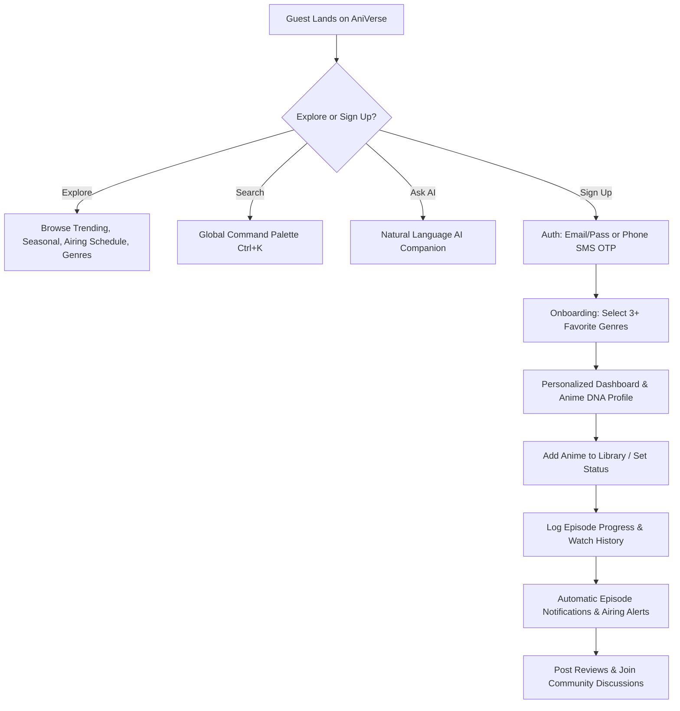
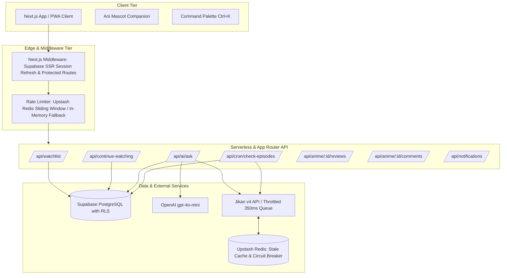
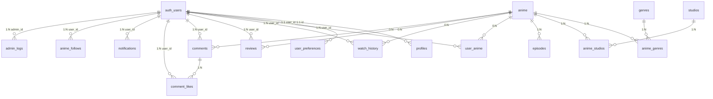

# Product Requirement Document (PRD): AniVerse (V2.0)

**Project Name**: AniVerse  
**Document Version**: 2.0.0  
**Status**: Active / Production-Ready  
**Repository**: `c:\aniverse`  
**Target Environment**: Next.js 14 App Router (Node.js 20+), Supabase PostgreSQL 16, Upstash Redis, OpenAI `gpt-4o-mini`, Vercel / Docker Standalone  

---

## 1. Executive Summary & Product Vision

### 1.1 Mission
**AniVerse** is an AI-powered, dark-first anime discovery engine, personal watch companion, and community platform. It solves anime discovery paralysis and fragmented tracking by unifying:
1. **Deterministic Anime Metadata**: Real-time retrieval and caching from the MyAnimeList/Jikan v4 API with zero broken links and automatic offline fallbacks.
2. **Grounded AI Reasoning ("Ask AniVerse")**: Conversational search and natural-language recommendations powered by OpenAI (`gpt-4o-mini`), strictly grounded on verified database candidates with zero hallucination.
3. **Anime DNA & Archetype Profiling**: Mathematical quantification of user taste into archetype badges (e.g., *The Mastermind Strategist*, *The Shonen Champion*), genre affinities, and watch habits.
4. **Comprehensive Watch Tracking & Playback Timeline**: 5-state personal library management (`WATCHING`, `COMPLETED`, `PLAN_TO_WATCH`, `ON_HOLD`, `DROPPED`), episode steppers, score ratings, and append-only watch history.
5. **Real-time Airing Schedules & Automated Episode Alerts**: Weekly broadcast schedules with cron-based notifications for newly aired episodes.
6. **Ultra-Polish Dark Neon Aesthetic**: Cinematic UI inspired by modern Japanese cyberpunk aesthetics, glassmorphism, responsive micro-animations, and an interactive mascot companion ("Ani").

---

## 2. Core Personas & User Journeys

### 2.1 Target Personas
* **The Seasonal Binge Watcher ("Otaku Pro")**: Tracks 10+ ongoing shows each season, needs instant episode step-logging, airing countdowns in JST, and notifications when new episodes air.
* **The Decision-Paralyzed Casual ("Curious Explorer")**: Overwhelmed by thousands of titles, searches by mood ("give me a wholesome cozy anime under 12 episodes"), seeks AI recommendations that match specific vibes.
* **The Analytic Anime Fan ("Taste Connoisseur")**: Cares deeply about personal stats, genre distributions, ratings, and discovering their Anime DNA personality archetype.
* **The Community Contributor ("Anime Critic")**: Writes thoughtful reviews, discusses plot twists, and interacts with other fans on anime discussion boards.

### 2.2 Core User Journeys


---

## 3. System Architecture & Tech Stack

### 3.1 Technology Stack Matrix
| Layer | Technology | Version / Specification | Rationale |
| :--- | :--- | :--- | :--- |
| **Framework** | Next.js (App Router) | `14.2.15` | Server Components by default, Server Actions, route handlers, standalone output |
| **Language** | TypeScript | `^5.5.4` (Strict Mode) | End-to-end type safety across client, server, and database |
| **Runtime** | Node.js / Vercel Edge | `>= 20.14.0` | High performance streaming SSR and fast cold starts |
| **Database & Auth** | Supabase (PostgreSQL 16) | `@supabase/supabase-js 2.48.1`, `@supabase/ssr 0.5.2` | Row Level Security (RLS), Postgres Triggers, Auth Cookies, Realtime |
| **Distributed Cache & Rate Limiting** | Upstash Redis | `@upstash/redis 1.34.3`, `@upstash/ratelimit 2.0.5` | Distributed sliding-window rate limiting & cross-instance stale cache fallback |
| **AI Companion** | OpenAI API | `openai 4.85.4` (`gpt-4o-mini`) | Structured JSON reasoning, intent extraction, grounded explanations |
| **Anime Data Source** | Jikan API v4 | `https://api.jikan.moe/v4` | Free MyAnimeList open metadata engine with client-side circuit breaker |
| **Styling & Design System** | Tailwind CSS | `3.4.10` | Custom neon dark palette, glassmorphism, responsive utilities |
| **Motion & Animation** | Framer Motion | `^11.3.19` | Fluid springs, layout transitions, mascot physics, notification drawer |
| **Validation** | Zod | `^3.23.8` | Runtime schema validation for all API inputs and AI schemas |
| **Testing** | Vitest & Playwright | `vitest 2.1.1`, `@playwright/test 1.47.0` | Comprehensive unit, integration, and cross-browser E2E testing |

### 3.2 System Architecture Diagram


---

## 4. Comprehensive Feature Specifications

### 4.1 Grounded AI Companion ("Ask AniVerse")
* **Location**: `/ask`, Home Page Hero CTA, Header Link.
* **Engine**: `src/lib/ai.ts`, `src/app/api/ai/ask/route.ts`.
* **Behavior & Logic**:
  1. **Intent Extraction**:
     - Natural language parsing using regex & keyword tokenization (`extractIntent`).
     - Detects 18+ canonical anime genres (Action, Sci-Fi, Psychological, Isekai, Slice of Life, etc.).
     - Detects episode constraints: Under/less than $N$ episodes (e.g., short/quick = 13 eps), Over/more than $N$ episodes.
     - Detects media type: TV series vs. Movie / Film.
     - Detects atmosphere / moods: Emotional / Sad / Cry (Drama), Dark / Gritty, Wholesome / Chill / Cozy (Slice of Life), Hype / Intense (Action), Mind-bending / Twists (Psychological).
     - Detects reference titles (e.g., *"like Attack on Titan"*, *"similar to Death Note"*).
  2. **Grounded Candidate Retrieval**:
     - Fetches verified anime from Jikan based on reference title and genre filters (`minScore: 7.0`, `orderBy: score`).
     - Automatically deduplicates and excludes anime already in the authenticated user's active watchlist (`userWatchlistMalIds`).
     - Strict filtering on episode caps, type, and minimum rating.
  3. **AI Reasoning Layer (`gpt-4o-mini`)**:
     - Passes retrieved candidate metadata (MAL ID, title, score, episodes, type, genres, synopsis) to OpenAI.
     - System prompt strictly instructs the LLM to **ONLY** reference candidate anime from the verified context list, preventing hallucinations.
     - Requests structured JSON schema:
       ```json
       {
         "message": "Friendly 2-3 sentence conversational intro",
         "reasons": [
           { "mal_id": 16498, "reason": "Specific 1-2 sentence explanation why this matches criteria" }
         ]
       }
       ```
  4. **Deterministic Heuristic Fallback**:
     - If `OPENAI_API_KEY` is missing or the external API is unreachable, an algorithmic explanation generator constructs tailored explanations based on detected moods, genres, episode counts, and review scores without throwing a user-facing error.
  5. **Rate Limiting**: Capped at 15 queries per minute per user / IP address via Upstash.

---

### 4.2 Anime DNA & Personality Profiling Engine
* **Location**: `/app/anime-dna`, Home Page Widget (`AnimeDNAWidget.tsx`), Profile Dashboard.
* **Engine**: `src/lib/anime-dna.ts`, `src/components/AnimeDnaDashboard.tsx`.
* **Telemetry & Metrics Calculated**:
  1. **Total Titles & Completion Rate**: Total library count, completed series count.
  2. **Watch Time Telemetry**: Total episodes watched, calculated total watch hours (`episodes * 23.5 min / 60`).
  3. **Average Rating Score**: Mean score across library rankings and user reviews.
  4. **Genre Affinity Percentages**: Relative distribution of favorite genres normalized to percentages (35%–98% scale) with interactive progress meters.
  5. **Archetype Badges**:
     - 🧠 **The Mastermind Strategist**: Top affinity in *Psychological* or *Mystery*. Narrative depth, mind games, multi-layered plotting.
     - 🔥 **The Shonen Champion**: Top affinity in *Action* or *Adventure*. High stakes, tournaments arcs, power progression, perseverance.
     - ☕ **The Wholesome Philosopher**: Top affinity in *Romance* or *Slice of Life*. Emotional warmth, everyday moments, deep relationships.
     - ⚡ **The Cybernetic Visionary**: Top affinity in *Sci-Fi* or *Mecha*. Futuristic speculative world-building, high-tech cyber aesthetics.
     - 🌌 **The Eclectic Explorer**: Balanced taste profile across diverse genres.
  6. **Dynamic Badges (`src/lib/badges.ts`)**:
     - `VERIFIED` (✓): Account email verified upon registration.
     - `TOP_REVIEWER` (✍️): Authored 3+ detailed anime reviews.
     - `ANIME_VETERAN` (🏆): Added 15+ titles to personal library.
     - `BINGE_WATCHER` (🍿): Completed 5+ anime series.
     - `GENRE_EXPLORER` (🌟): Explored and customized genre preferences.

---

### 4.3 Personal Library & Watch Tracking System
* **Location**: `/app/library`, `/watchlist`, `WatchlistBoard.tsx`, `WatchlistButton.tsx`.
* **Features & Controls**:
  1. **5 Canonical Tracking States**:
     - `WATCHING` (Actively viewing)
     - `COMPLETED` (Finished series, records `completed_at` timestamp)
     - `PLAN_TO_WATCH` (Saved for later)
     - `ON_HOLD` (Temporarily paused)
     - `DROPPED` (Discontinued)
  2. **Status Tabs & Live Counters**:
     - Filter tabs with exact count chips: Watching, Completed, Plan to Watch, On Hold, Dropped, Favorites, All Titles.
  3. **In-Library Instant Search**: Substring search filtering within user's personal collection.
  4. **Episode Stepper Controls**:
     - `+` and `−` buttons with optimistic state updates.
     - Dynamic progress bar rendering `% completed = (current_episode / total_episodes) * 100`.
  5. **Star Rating Component (`StarRating.tsx`)**:
     - 10-point rating scale rendered as 5 interactive half/full stars with hover preview and reset capability.
  6. **Favorites Toggle**: One-click heart toggle (`❤️` / `🤍`) with instant DB persistence.
  7. **Removal**: Safe removal action with optimistic card removal and backend cleanup.

---

### 4.4 Real-time Playback Timeline & Watch History
* **Location**: `/app/history`, `src/app/api/continue-watching/route.ts`.
* **Behavior**:
  1. **Dual-Write Architecture**:
     - Whenever a user advances an episode or reports playback timestamp via `/api/continue-watching`, the system updates the active pointer on `public.user_anime` AND appends an immutable record to `public.watch_history`.
  2. **Append-Only Timeline**:
     - Logs: `user_id`, `mal_id`, `episode_number`, `progress_seconds`, `duration_seconds`, `watched_at`.
     - Displays chronological playback log with episode number, minutes played, and localized relative time formatting.
  3. **Continue Watching Carousel (`ContinueWatchingRow.tsx`)**:
     - Rendered on Home & Library pages.
     - Shows current progress bar and a quick `+1 ep` one-click increment button.

---

### 4.5 Airing Calendar & Automated Episode Notification Engine
* **Location**: `/schedule`, `BroadcastTicker.tsx`, `NotificationBell.tsx`, `/api/cron/check-episodes`.
* **Airing Guide**:
  - Weekly weekday selector: Sunday through Saturday.
  - Live broadcast hours displayed in Japan Standard Time (JST).
  - "On Air Now" pulsing indicator dot (`.on-air-dot`).
* **Automated Episode Alert Cron (`/api/cron/check-episodes`)**:
  - Protected by `Bearer ${CRON_SECRET}` header.
  - Inspects all titles marked `WATCHING` across all users.
  - Queries Jikan API for latest episode counts.
  - Compares Jikan `episodes` against cached `public.anime.last_episodes`.
  - When `anime.episodes > last_episodes`:
    - Dispatches a `NEW_EPISODE` notification into `public.notifications` for every active watcher:
      `"Episode {ep} of {title} is now out!"`
    - Updates local `public.anime.last_episodes` cache.
* **Notification Center (`NotificationBell.tsx`)**:
  - Auto-polls `/api/notifications` every 25 seconds.
  - Shows animated badge with unread count.
  - Dropdown drawer with relative timestamp (`"5m ago"`), read/unread status indicator.
  - "Mark all read" and individual mark-read actions.

---

### 4.6 Anime Details Experience (`/anime/[id]`)
* **Location**: `src/app/anime/[id]/page.tsx`.
* **Rich Metadata Header**:
  - Dynamic blurred backdrop banner with gradient overlay and film grain texture.
  - Cover poster, English and Romaji title display.
  - Score (★), MAL popularity rank, episode count, duration, rating, broadcast schedule.
  - Genre pill tags linking to genre pages.
  - Full synopsis.
* **Official Streaming Platform Links**:
  - Deep-linked streaming buttons with official brand colors:
    - Crunchyroll (`#F47521`), Netflix (`#E50914`), Hulu (`#1CE783`), Prime Video (`#00A8E1`), HIDIVE (`#4A3AFF`), Disney+ (`#113CCF`), Max (`#9B51E0`).
  - Fallback search query links if direct official streaming URL is not in MAL metadata.
* **Embedded Video Player**:
  - Responsive YouTube trailer iframe embed (`aspect-video`).
* **SEO & Structured Data (JSON-LD)**:
  - Generates dynamic Schema.org `TVSeries` or `Movie` structured data.
  - Includes `name`, `alternateName`, `description`, `image`, `genre`, `datePublished`, `numberOfEpisodes`, and `AggregateRating` (ratingValue, bestRating: 10, ratingCount).
  - OpenGraph `video.tv_show` and Twitter Summary Large Image cards.
* **Reviews & Comments**:
  - Suspense-wrapped `<ReviewSection>` and `<CommentSection>`.

---

### 4.7 Community Discussions & Reviews
* **Location**: `/community`, `/anime/[id]`, `CommentSection.tsx`, `ReviewSection.tsx`.
* **Review System**:
  - 1–10 star score rating, title, and detailed markdown body.
  - One review per user per anime (`UNIQUE(user_id, mal_id)` constraint).
  - Like count counter.
  - Author badge, avatar initials, and formatted timestamp.
* **Comment System**:
  - General discussion threads on every anime page.
  - Soft deletion support (`deleted_at IS NULL` RLS check).
  - Likes table (`comment_likes`) preventing duplicate likes per user.
* **Community Pulse Feed (`/community`)**:
  - Global real-time stream of latest comments across all anime titles.
  - Links directly to anime posters and discussion threads.

---

### 4.8 Interactive Mascot Companion ("Ani")
* **Location**: `src/components/anime-character/`, `ScrollCharacterCard.tsx`.
* **Features**:
  - Floating 2D anime mascot character ("Ani") rendered in the bottom right corner with smooth physics.
  - Framer Motion spring configuration (`stiffness: 75, damping: 22, mass: 0.8`).
  - Subtle floating oscillation (`yDistance: 6px, duration: 3.8s, rotation: 1.5deg`).
  - **Scroll Section Observer**: Tracks user's active viewport position across 8 page sections (`hero`, `continue-watching`, `seasonal`, `recommendations`, `trending`, `top-ranked`, `community`, `share`).
  - Dynamic speech bubble reactions that change based on context (e.g., *"Picking up right where you left off? 🍿"*, *"I picked these based on your unique Anime DNA 🧬"*).
  - Dismissible / minimizable interaction states.

---

### 4.9 Global Command Palette (`Ctrl+K` / `Cmd+K`)
* **Location**: `src/components/search/CommandPalette.tsx`, `AppTopNav.tsx`.
* **Capabilities**:
  - Global keyboard trigger: `Ctrl+K` (Windows/Linux) or `Cmd+K` (macOS).
  - Instant modal overlay with backdrop blur.
  - Real-time debounced search against Jikan API.
  - Keyboard arrow navigation (`ArrowDown`, `ArrowUp`, `Enter`, `Escape`).
  - Quick action links: Trending, Seasonal, Random Anime, Airing Schedule.
  - Clean poster thumbnail previews, scores, and episode counters.

---

### 4.10 Authentication & Onboarding Architecture
* **Location**: `/login`, `/register`, `/forgot-password`, `/reset-password`, `/onboarding`, `PhoneAuthForm.tsx`.
* **Auth Modes**:
  1. **Email & Password**:
     - Supabase SSR cookie-based authentication with auto token refresh in Next.js middleware.
     - Strong password validation rules (`PasswordChecklist.tsx`).
  2. **Phone Number SMS OTP**:
     - Country code selector with 11 international prefixes (+1, +91, +44, +81, +61, +49, +33, +82, +55, +63, +62).
     - Clean number normalization (strips non-digits).
     - 6-digit auto-advancing OTP cell inputs with backspace recovery.
     - 60-second cooldown timer for SMS OTP resend.
  3. **First-Time User Provisioning**:
     - Database trigger `public.handle_new_user()` auto-provisions a `profiles` row with username/avatar and a `user_preferences` row.
  4. **Onboarding Questionnaire (`/onboarding`)**:
     - Displays 12 featured genres (Action, Adventure, Comedy, Drama, Fantasy, Romance, Sci-Fi, Shounen, Sports, Slice of Life, Supernatural, Thriller).
     - Saves initial preferences into `user_preferences.favorite_genres` to jumpstart personalized recommendations.

---

### 4.11 Admin Control Center & Telemetry Dashboard
* **Location**: `/admin`, `/admin/users`, `/admin/monitoring`, `/admin/analytics`, `src/lib/admin.ts`.
* **Capabilities (Admin Role Only)**:
  - **Live Service Health Dots**: Real-time operational check for Supabase DB and Jikan API.
  - **KPI Stat Cards**: Total users, new users in past 7 days, 7-day user growth % (`percentChange`), total library items tracked, total comments authored.
  - **User Management Table**: Profile browsing, role badge (`ADMIN` vs `USER`), joined date, username search.
  - **Audit Logging Table (`admin_logs`)**: RLS-protected audit log of administrative actions.

---

### 4.12 Resilience, Caching & Fallback Architecture
* **Location**: `src/lib/jikan.ts`, `src/lib/rate-limit.ts`, `src/lib/fallback-anime.ts`.
* **Mechanisms**:
  1. **Throttled Request Queue**:
     - Enforces a minimum gap of 350ms between outgoing requests to comply with Jikan's 3 req/sec rate limit.
  2. **Distributed Stale-While-Revalidate**:
     - Caches successful Jikan responses in Upstash Redis (or in-memory map) with a 24-hour maximum stale age (`STALE_MAX_AGE_MS`).
     - If Jikan errors or times out, the system seamlessly serves the last known stale response instead of throwing a 500 error.
  3. **Circuit Breaker Pattern**:
     - Tracks consecutive failures (`FAILURE_THRESHOLD = 5`).
     - Once tripped, the circuit opens for 30 seconds (`COOLDOWN_MS = 30000`), immediately routing requests to stale cache or fallback data to prevent server latency exhaustion.
  4. **Offline Static Fallback Library (`FALLBACK_ANIME`)**:
     - High-fidelity pre-cached data for legendary series (Attack on Titan, Jujutsu Kaisen, Chainsaw Man, Fullmetal Alchemist: Brotherhood, Death Note) served when Jikan is completely unreachable and cache is cold.
  5. **Hybrid Rate Limiter**:
     - Checks Upstash Redis sliding window if configured; gracefully falls open to in-memory sliding bucket if Redis is offline.

---

### 4.13 Multi-Platform Social Sharing
* **Location**: `src/components/ShareSection.tsx`, `ShareBanner.tsx`, `ShareCard.tsx`.
* **Direct Integration Channels**:
  - **Telegram**: Formatted message with direct deep link.
  - **X (Twitter)**: Prefilled tweet intent URL.
  - **WhatsApp**: `wa.me` share intent.
  - **Facebook**: Facebook Sharer dialog.
  - **Reddit**: Submit link with prefilled title.
  - **Instagram**: Native Web Share API (`navigator.share`) with automatic clipboard fallback.
  - **Copy Link**: One-click clipboard copy with status feedback.

---

### 4.14 Progressive Web App (PWA) & Mobile UX
* **Location**: `public/manifest.json`, `public/sw.js`, `ServiceWorkerRegister.tsx`, `InstallPrompt.tsx`, `MobileNav.tsx`.
* **PWA Features**:
  - Service worker caching for static assets and shell navigation.
  - `beforeinstallprompt` capture with custom branded install drawer ("Install AniVerse App").
  - Mobile bottom navigation dock (`MobileNav.tsx`) with quick access to Home, Trending, Library, Schedule, and AI Chat.
  - Safe-area-inset padding for notch-enabled iOS & Android displays (`safe-top`, `safe-bottom`).

---

### 4.15 Internationalization (i18n)
* **Location**: `src/i18n/`, `LanguageSwitcher.tsx`.
* **Languages Supported**:
  - 🇺🇸 English (`en`)
  - 🇮🇳 Hindi (`hi`)
  - 🇧🇩 Bengali (`bn`)
* **Architecture**:
  - `I18nProvider.tsx` React context wrapping root layout.
  - JSON message catalogs with interpolation support (`src/i18n/messages/*.json`).
  - Persistent language selection stored in cookies / local state.

---

## 5. Complete Database Schema & RLS Policy Specification

### 5.1 Tables & Entity Relationship Model



### 5.2 Table Definitions

#### 1. `public.profiles`
| Column | Type | Constraints | Description |
| :--- | :--- | :--- | :--- |
| `id` | `UUID` | `PK, REFERENCES auth.users(id) ON DELETE CASCADE` | Supabase User ID |
| `username` | `TEXT` | `UNIQUE` | Unique handle |
| `display_name` | `TEXT` | | User full display name |
| `avatar_url` | `TEXT` | | Profile avatar image link |
| `bio` | `TEXT` | | Personal user biography |
| `role` | `TEXT` | `NOT NULL DEFAULT 'USER' CHECK (role IN ('USER', 'ADMIN'))` | Role-based authorization |
| `created_at` | `TIMESTAMPTZ` | `NOT NULL DEFAULT NOW()` | Creation timestamp |
| `updated_at` | `TIMESTAMPTZ` | `NOT NULL DEFAULT NOW()` | Update timestamp |

#### 2. `public.anime` (Local Cache & Foreign Key Anchor)
| Column | Type | Constraints | Description |
| :--- | :--- | :--- | :--- |
| `id` | `UUID` | `PK DEFAULT gen_random_uuid()` | Local unique ID |
| `mal_id` | `INTEGER` | `NOT NULL UNIQUE` | Canonical MyAnimeList ID |
| `title` | `TEXT` | `NOT NULL` | Primary title |
| `title_english` | `TEXT` | | English localized title |
| `title_japanese`| `TEXT` | | Japanese kanji/kana title |
| `synopsis` | `TEXT` | | Plot synopsis |
| `image_url` | `TEXT` | | Primary poster image |
| `banner_url` | `TEXT` | | Wide backdrop banner |
| `type` | `TEXT` | | TV, Movie, OVA, Special |
| `status` | `TEXT` | | Currently Airing, Finished, etc. |
| `episodes` | `INTEGER` | | Total episode count |
| `duration` | `TEXT` | | Runtime duration |
| `score` | `NUMERIC(4, 2)`| | Rating (e.g. 8.85) |
| `rank` | `INTEGER` | | Global rank |
| `popularity` | `INTEGER` | | Popularity rank |
| `season` | `TEXT` | | Spring, Summer, Fall, Winter |
| `year` | `INTEGER` | | Release year |
| `source` | `TEXT` | | Manga, Light Novel, Original |
| `rating` | `TEXT` | | PG-13, R - 17+, etc. |
| `last_episodes`| `INTEGER` | `NOT NULL DEFAULT 0` | Episode cache count for cron change detection |
| `created_at` | `TIMESTAMPTZ` | `NOT NULL DEFAULT NOW()` | Record creation |
| `updated_at` | `TIMESTAMPTZ` | `NOT NULL DEFAULT NOW()` | Record update |

#### 3. `public.user_anime` (Primary Library Tracking)
| Column | Type | Constraints | Description |
| :--- | :--- | :--- | :--- |
| `id` | `UUID` | `PK DEFAULT gen_random_uuid()` | Record ID |
| `user_id` | `UUID` | `NOT NULL REFERENCES auth.users(id) ON DELETE CASCADE` | Owner ID |
| `anime_id` | `UUID` | `REFERENCES public.anime(id) ON DELETE SET NULL` | Local anime reference |
| `mal_id` | `INTEGER` | `NOT NULL` | MyAnimeList identifier |
| `title` | `TEXT` | `NOT NULL` | Display title |
| `image_url` | `TEXT` | | Poster thumbnail |
| `total_episodes`| `INTEGER` | | Total episodes |
| `status` | `TEXT` | `NOT NULL DEFAULT 'PLAN_TO_WATCH' CHECK (status IN ('WATCHING','COMPLETED','PLAN_TO_WATCH','ON_HOLD','DROPPED'))` | Watch status |
| `current_episode`|`INTEGER` | `NOT NULL DEFAULT 0` | Current episode reached |
| `progress_seconds`|`INTEGER`| `NOT NULL DEFAULT 0` | Media playback second offset |
| `score` | `INTEGER` | `CHECK (score IS NULL OR (score >= 1 AND score <= 10))` | Personal rating 1-10 |
| `is_favorite` | `BOOLEAN` | `NOT NULL DEFAULT FALSE` | Favorite bookmark flag |
| `started_at` | `TIMESTAMPTZ` | | Watch start date |
| `completed_at` | `TIMESTAMPTZ` | | Series completion date |
| `created_at` | `TIMESTAMPTZ` | `NOT NULL DEFAULT NOW()` | Added to library |
| `updated_at` | `TIMESTAMPTZ` | `NOT NULL DEFAULT NOW()` | Last update timestamp |
| **Constraint** | `UNIQUE(user_id, mal_id)` | | Prevents duplicate library items |

#### 4. `public.watch_history` (Append-Only Playback Log)
| Column | Type | Constraints | Description |
| :--- | :--- | :--- | :--- |
| `id` | `UUID` | `PK DEFAULT gen_random_uuid()` | Log ID |
| `user_id` | `UUID` | `NOT NULL REFERENCES auth.users(id) ON DELETE CASCADE` | User ID |
| `anime_id` | `UUID` | `REFERENCES public.anime(id) ON DELETE SET NULL` | Optional local anime ID |
| `mal_id` | `INTEGER` | `NOT NULL` | MyAnimeList ID |
| `episode_number`|`INTEGER` | `NOT NULL DEFAULT 1` | Episode logged |
| `progress_seconds`|`INTEGER`| `NOT NULL DEFAULT 0` | Playback position |
| `duration_seconds`|`INTEGER`| | Episode total duration |
| `watched_at` | `TIMESTAMPTZ` | `NOT NULL DEFAULT NOW()` | Exact timestamp of watch |

#### 5. `public.reviews`
| Column | Type | Constraints | Description |
| :--- | :--- | :--- | :--- |
| `id` | `UUID` | `PK DEFAULT gen_random_uuid()` | Review ID |
| `user_id` | `UUID` | `NOT NULL REFERENCES auth.users(id) ON DELETE CASCADE` | Reviewer |
| `anime_id` | `UUID` | `REFERENCES public.anime(id) ON DELETE SET NULL` | Local anime ID |
| `mal_id` | `INTEGER` | `NOT NULL` | MyAnimeList ID |
| `rating` | `INTEGER` | `NOT NULL CHECK (rating >= 1 AND rating <= 10)` | Score 1 to 10 |
| `title` | `TEXT` | | Review headline |
| `content` | `TEXT` | | Detailed review body |
| `likes_count` | `INTEGER` | `NOT NULL DEFAULT 0` | Number of upvotes |
| `created_at` | `TIMESTAMPTZ` | `NOT NULL DEFAULT NOW()` | Created date |
| `updated_at` | `TIMESTAMPTZ` | `NOT NULL DEFAULT NOW()` | Edited date |
| **Constraint** | `UNIQUE(user_id, mal_id)` | | One review per anime per user |

#### 6. `public.comments` & `public.comment_likes`
* `comments`: `id` (UUID), `user_id` (UUID), `anime_id` (UUID), `mal_id` (INTEGER), `content` (TEXT), `like_count` (INTEGER), `deleted_at` (TIMESTAMPTZ soft delete), `created_at` (TIMESTAMPTZ).
* `comment_likes`: `id` (UUID), `comment_id` (UUID), `user_id` (UUID), `created_at` (TIMESTAMPTZ), `UNIQUE(comment_id, user_id)`.

#### 7. `public.notifications`
| Column | Type | Constraints | Description |
| :--- | :--- | :--- | :--- |
| `id` | `UUID` | `PK DEFAULT gen_random_uuid()` | Notification ID |
| `user_id` | `UUID` | `NOT NULL REFERENCES auth.users(id) ON DELETE CASCADE` | Recipient user |
| `type` | `TEXT` | `NOT NULL CHECK (type IN ('NEW_EPISODE', 'RECOMMENDATION', 'WATCHLIST_REMINDER', 'SYSTEM', 'COMMUNITY'))` | Notification category |
| `title` | `TEXT` | `NOT NULL` | Header message |
| `message` | `TEXT` | `NOT NULL` | Body explanation |
| `data` | `JSONB` | `NOT NULL DEFAULT '{}'::jsonb` | Payload `{ mal_id: 123, episode: 4 }` |
| `read_at` | `TIMESTAMPTZ` | | Read timestamp (`NULL` if unread) |
| `created_at` | `TIMESTAMPTZ` | `NOT NULL DEFAULT NOW()` | Creation timestamp |

#### 8. `public.user_preferences`
* `user_id` (UUID UNIQUE PK), `favorite_genres` (JSONB array of MAL IDs), `favorite_studios` (JSONB), `preferred_types` (JSONB), `preferred_themes` (JSONB), `preferred_episode_length` (TEXT), `preference_vector` (JSONB embeddings), `updated_at` (TIMESTAMPTZ).

#### 9. `public.admin_logs`
* `id` (UUID PK), `admin_id` (UUID FK auth.users), `action` (TEXT), `target_type` (TEXT), `target_id` (TEXT), `target_summary` (TEXT), `details` (TEXT), `created_at` (TIMESTAMPTZ).

---

### 5.3 Row Level Security (RLS) Policy Matrix
Every single table in AniVerse enforces Row Level Security (`ALTER TABLE ... ENABLE ROW LEVEL SECURITY;`).

| Table | Operation | Policy Name | Using / With Check Expression |
| :--- | :--- | :--- | :--- |
| `profiles` | `SELECT` | Public profiles readable | `true` |
| `profiles` | `UPDATE` | Users update own profile | `auth.uid() = id` |
| `anime` | `SELECT` | Anime cache public read | `true` |
| `anime` | `INSERT/UPDATE` | Authenticated users cache update | `auth.role() = 'authenticated'` |
| `user_anime` | `SELECT` | View own library | `auth.uid() = user_id` |
| `user_anime` | `INSERT` | Insert into own library | `auth.uid() = user_id` |
| `user_anime` | `UPDATE` | Update own library | `auth.uid() = user_id` |
| `user_anime` | `DELETE` | Delete from own library | `auth.uid() = user_id` |
| `watch_history` | `SELECT` | View own watch history | `auth.uid() = user_id` |
| `watch_history` | `INSERT` | Insert own watch history | `auth.uid() = user_id` |
| `reviews` | `SELECT` | Reviews public read | `true` |
| `reviews` | `INSERT/UPDATE/DELETE` | Manage own reviews | `auth.uid() = user_id` |
| `comments` | `SELECT` | Comments public read | `deleted_at IS NULL OR auth.uid() = user_id` |
| `comments` | `INSERT/UPDATE` | Manage own comments | `auth.uid() = user_id` |
| `comment_likes` | `ALL` | Manage own comment likes | `auth.uid() = user_id` |
| `notifications` | `SELECT/UPDATE` | View & update own alerts | `auth.uid() = user_id` |
| `user_preferences` | `SELECT/UPDATE` | View & update own prefs | `auth.uid() = user_id` |
| `admin_logs` | `SELECT` | Admin-only access | `EXISTS (SELECT 1 FROM public.profiles WHERE profiles.id = auth.uid() AND profiles.role = 'ADMIN')` |

---

## 6. Complete API Route Catalog

All routes are standardized using `withApiHandler` (`src/lib/api.ts`) returning `{ ok: true, data: T }` or `{ ok: false, error: string, code: string }`.

| Endpoint | Method | Auth Required | Rate Limit | Description |
| :--- | :--- | :--- | :--- | :--- |
| `/api/ai/ask` | `POST` | Optional (Guest/User) | 15 req / min | Natural language anime query & grounded recommendation engine |
| `/api/anime/[id]` | `GET` | No | Cached (1 hr) | Returns detailed anime metadata from Jikan with stale fallback |
| `/api/anime/[id]/comments` | `GET` | No | Public | Returns paginated top-level comments for an anime |
| `/api/anime/[id]/comments` | `POST` | Yes | 30 req / min | Posts a new comment on an anime title |
| `/api/anime/[id]/reviews` | `GET` | No | Public | Returns user reviews for an anime |
| `/api/anime/[id]/reviews` | `POST` | Yes | 15 req / min | Creates or updates user's review for an anime |
| `/api/watchlist` | `GET` | Yes | User session | Fetches complete user library sorted by `updated_at DESC` |
| `/api/watchlist` | `POST` | Yes | 30 req / min | Upserts an anime title into user library (`status`, `current_episode`, `score`) |
| `/api/watchlist/[id]` | `PATCH` | Yes | 30 req / min | Updates episode count, score, favorite flag, or status (accepts UUID or MAL ID) |
| `/api/watchlist/[id]` | `DELETE` | Yes | 30 req / min | Deletes title from user's personal library |
| `/api/continue-watching` | `GET` | Yes | User session | Retrieves top 12 active series with status `WATCHING` |
| `/api/continue-watching` | `POST` | Yes | 60 req / min | Dual-write: updates `user_anime` pointer and appends to `watch_history` |
| `/api/notifications` | `GET` | Yes | Polled (25s) | Returns user's unread notifications and total unread count |
| `/api/notifications` | `PATCH` | Yes | User session | Marks a specific notification as read (`read_at = NOW()`) |
| `/api/notifications/read-all` | `POST` | Yes | User session | Marks all unread notifications for the user as read |
| `/api/cron/check-episodes` | `GET` | `CRON_SECRET` | Automated | Syncs episode updates from Jikan and dispatches notifications |
| `/api/health` | `GET` | No | Public | Telemetry: Supabase connection, Jikan circuit breaker status & failure count |
| `/api/trending` | `GET` | No | Cached | Returns trending airing titles |
| `/api/recommendations` | `GET` | Optional | Cached | Contextual recommendations based on user library or seasonal picks |
| `/api/auth/phone` | `POST` | No | 5 req / min | Initiates Firebase/Supabase Phone SMS OTP delivery |
| `/api/user/preferences` | `PATCH` | Yes | User session | Updates user genre and studio affinities |

---

## 7. UI/UX Design System & Aesthetics Specification

### 7.1 Visual Philosophy: Dark-First Neon Cyberpunk
AniVerse enforces a cinematic, glassmorphic dark aesthetic. Standard generic browser defaults are completely prohibited.
* **Background Atmosphere**: Pure obsidian deep space (`--c-void: 7 7 13`) layered with an SVG grain texture (`bg-grain`, 5% opacity) to eliminate color banding and create tactile cinematic depth.
* **Glassmorphism Panels**:
  - `panel`: `rgb(16 16 26)` with 8% white border line (`--c-line: rgba(255, 255, 255, 0.08)`).
  - `panel2`: `rgb(21 21 36)` with subtle neon elevation.
  - `panel3`: `rgb(27 26 44)` for high-contrast interactive elements.

### 7.2 Color Palette Tokens
| Token | Dark Value | Light Value | Semantic Purpose |
| :--- | :--- | :--- | :--- |
| `void` | `rgb(7, 7, 13)` | `rgb(248, 248, 252)` | Canvas foundation, main page background |
| `panel` | `rgb(16, 16, 26)` | `rgb(255, 255, 255)` | Card containers, navigation bars, dropdowns |
| `panel2` | `rgb(21, 21, 36)` | `rgb(240, 240, 246)` | Inner wells, inputs, elevated card hover states |
| `ink` | `rgb(255, 255, 255)`| `rgb(15, 14, 23)` | Primary typography, headers, active titles |
| `ink-dim` | `rgb(148, 150, 168)`| `rgb(85, 83, 100)` | Body descriptions, metadata, subtitles |
| `ink-faint` | `rgb(90, 92, 114)` | `rgb(140, 138, 155)` | Micro-labels, episode count indicators, borders |
| `pink` | `rgb(255, 46, 116)` | `rgb(255, 46, 116)` | Brand accent, on-air dot, primary buttons, badges |
| `cyan` | `rgb(0, 240, 255)` | `rgb(0, 160, 180)` | Secondary neon accent, links, active progress bars |
| `amber` | `rgb(255, 180, 50)` | `rgb(210, 120, 10)` | Star ratings (★), spotlight highlights |

### 7.3 Typography Standards
* **Display Font**: `Bebas Neue` (fallback: `Impact`, sans-serif) — High-impact, condensed cinematic titles for heroes, section headlines, and badges.
* **Body Font**: `Inter` (system-ui, sans-serif) — Highly legible body text, synopses, reviews, and interactive UI controls.
* **Mono Font**: `IBM Plex Mono` (monospace) — Eyebrows, timestamps, JST broadcast clocks, episode steppers, rating chips.

### 7.4 Micro-Animations & Motion Design
* **`on-air-dot`**: 1.6s pulsing neon dot indicating live broadcasts.
* **`particle-float`**: 3s floating ambient particles on splash screen and mascot.
* **`splash-in`**: 0.7s smooth ease-out upward entry for modal sheets and hero titles.
* **`glow-pulse`**: 2.5s glowing outline cycle on active CTA buttons.
* **Interactive Hover Scaling**: Anime cards feature `group-hover:scale-105` transition with 500ms duration.

---

## 8. Security, Performance & Operational Guarantees

### 8.1 Security & Headers Policy
Configured in `next.config.mjs`:
* **Content Security Policy (CSP)**:
  - `frame-src`: Restricts embeds to `'self'` and `https://www.youtube.com`, `https://www.youtube-nocookie.com`, Google reCAPTCHA.
  - `img-src`: Strictly whitelists `'self'`, `data:`, `blob:`, `https://*.cdn.myanimelist.net`, `https://images.unsplash.com`.
  - `connect-src`: Whitelists `'self'`, `https://api.jikan.moe`, `https://*.supabase.co`, `https://*.google.com`.
* **Clickjacking Protection**: `X-Frame-Options: DENY`, `frame-ancestors 'none'`.
* **MIME Sniffing Defense**: `X-Content-Type-Options: nosniff`.
* **Strict Transport Security (HSTS)**: `max-age=63072000; includeSubDomains; preload`.
* **Referrer Policy**: `strict-origin-when-cross-origin`.
* **Permissions Policy**: `camera=(), microphone=(), geolocation=()`.

### 8.2 Reliability & Fault Tolerance SLA
1. **Jikan Rate Limit Resilience**: Outgoing requests queue with mandatory 350ms gaps to eliminate HTTP 429 errors from public upstream endpoints.
2. **Circuit Breaker Cooldown**: 5 consecutive upstream failures automatically trip circuit breaker for 30s, preventing cascading thread lockup on serverless runtimes.
3. **Stale Cache Fallback**: Server serves up to 24-hour-old stale cached responses if Jikan suffers third-party downtime.
4. **Offline Static Seed**: If both Jikan and cache are cold, the platform serves curated offline masterpieces without returning a 500 error.
5. **Rate Limiting Fail-Open**: If Upstash Redis connection drops, rate limiting falls back to local in-memory sliding window rather than crashing incoming requests.

---

## 9. Model Context Protocol (MCP) & Developer Tooling Ecosystem

AniVerse integrates 27 reference repositories and 6 active MCP servers configured in Antigravity IDE (`.agents/skills/mcp-ecosystem/SKILL.md`):

| MCP Server | Runtime / Package | Purpose in AniVerse |
| :--- | :--- | :--- |
| **Playwright MCP** | `@playwright/mcp` | Runs headless browser sessions, E2E flow testing (`e2e/`), and UI snapshot verification |
| **Supabase MCP** | `@supabase/mcp-server-supabase` | Inspects database schema, runs live SQL migrations, tests RLS policies and triggers |
| **Figma Context MCP** | `figma-developer-mcp` | Reads Figma design tokens, glassmorphism layouts, and auto-generates Tailwind CSS |
| **Magic UI MCP** | `@21st-dev/magic` | Rapidly scaffolds high-polish anime companion components and micro-interactions |
| **GitHub MCP** | `ghcr.io/github/github-mcp-server` | Manages PRs, issue triage, and version control branches |
| **Inspector MCP** | `@modelcontextprotocol/inspector` | Interactive debugger for testing agent tool payloads and MCP resource schemas |

---

## 10. Quality Assurance & Verification Suite

### 10.1 Automated Test Suites
1. **Vitest Unit & Integration Tests (`npm test`)**:
   - `src/lib/api.test.ts`: Validates API envelope parsing, status codes, and error formatting.
   - `src/lib/jikan.test.ts`: Validates throttling queue, stale cache retrieval, and circuit breaker trip logic.
   - `src/lib/rate-limit.test.ts`: Tests Upstash Redis and in-memory rate limiting sliding window algorithms.
   - `src/lib/admin.test.ts`: Verifies admin authorization guard, user query filters, and audit log generation.
   - `src/lib/analytics.test.ts`: Validates mathematical percentage change formulas.
   - `src/components/AnimeCharacter.test.tsx`: Validates mascot render, speech bubble transitions, and scroll events.
   - `src/components/ThemeToggle.test.tsx`: Validates light/dark class switching on document element.
2. **Playwright End-to-End Suite (`npm run test:e2e`)**:
   - Authentication flow (Register -> Login -> Session Cookie check -> Protected `/app/library` redirect).
   - Watchlist board interactions (Add title -> bump episode -> set rating -> toggle favorite -> delete).
   - AI Companion chat interaction (`/ask` input -> response streaming -> card rendering).
   - Accessibility & contrast audit via `@axe-core/playwright`.
3. **Continuous Type Checking & Linting**:
   - TypeScript compiler verification: `npm run typecheck` (`tsc --noEmit`).
   - ESLint static analysis: `npm run lint` (`next lint`).
   - Standalone Production Build: `npm run build`.

---

## 11. Release Milestones & Future Roadmap

### 11.1 V2.0 (Current Release)
- [x] Next.js 14 App Router migration with Server Components.
- [x] Full Supabase PostgreSQL schema with 16 tables, triggers, and Row Level Security.
- [x] Grounded OpenAI `gpt-4o-mini` conversational anime companion with fallback heuristic generator.
- [x] Anime DNA taste profiling, 5 archetype badges, and watch time telemetry.
- [x] 5-state watchlist board with episode steppers and star ratings.
- [x] Append-only playback history and continue watching carousels.
- [x] Airing calendar, broadcast ticker, and automated episode notification cron.
- [x] Interactive floating anime mascot ("Ani") with scroll-rigged speech reactions.
- [x] Phone number SMS OTP authentication with country code picker.
- [x] Global command palette (`Ctrl+K`).
- [x] Multi-platform social sharing (Telegram, WhatsApp, X, Facebook, Reddit, Instagram).
- [x] Distributed Upstash Redis rate limiting and Jikan circuit breaker.
- [x] Multilingual i18n support (English, Hindi, Bengali).
- [x] PWA offline caching and custom installation prompt.

### 11.2 Future Roadmap (V2.1+)
- [ ] **Vector Embeddings for Semantic Search**: Store pgvector embeddings in Supabase for sub-second semantic anime discovery.
- [ ] **Realtime Watch Parties**: Synchronized playback timers and live chat rooms using Supabase Realtime Channels.
- [ ] **Custom User List Exports**: Two-way sync with MyAnimeList and AniList accounts via OAuth2.
- [ ] **Three.js 3D Interactive Mascot Viewer**: WebGL canvas 3D mascot with customizable accessories and animations.
- [ ] **Push Notification Webhooks**: Web Push API for background notifications when AniVerse tab is closed.
